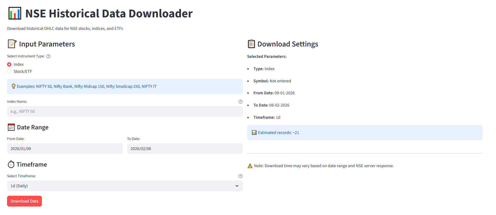

# NSE Historical Data Downloader

Download historical OHLC (Open, High, Low, Close) data for NSE stocks, indices, and ETFs. Timeframes supported: Daily (1d), Weekly (1w), Monthly (1m)

GitHub Repository: https://github.com/kython220282/NSE-Data-Downloader

## Screenshot



## Live Demo

Try the application on: https://nse-data-downloader.streamlit.app/

## Features

- Download data for stocks, indices, and ETFs from NSE India
- Multiple timeframes: Daily (1d), Weekly (1w), Monthly (1m)
- Web-based UI (Streamlit) or Command-line interface
- Auto-normalization of index names for NSE format
- Progress tracking during downloads
- CSV export functionality

## Prerequisites

- Python 3.8 or higher
- Virtual environment (recommended)

## Installation

1. Clone the repository:

```
git clone https://github.com/kython220282/NSE-Data-Downloader.git
cd NSE-Data-Downloader
```

2. Create and activate virtual environment:

```
python -m venv .venv
.venv\Scripts\activate
```

3. Install required packages:

```
uv pip install -r requirements.txt
```

Or install manually:

```
uv pip install streamlit pandas requests
```

## Usage Method 1: Streamlit Web Application

### Starting the Application

Run the following command in your terminal:

```
streamlit run app.py
```

The application will open in your browser at http://localhost:8501

### Using the Web Interface

1. Select Instrument Type:
   - Choose "Index" for market indices
   - Choose "Stock/ETF" for individual stocks or ETFs

2. Enter Symbol/Index Name:
   - For Indices: NIFTY 50, Nifty Bank, Nifty Midcap 150, etc.
   - For Stocks: RELIANCE, TCS, INFY, etc.
   - For ETFs: NIFTYBEES, BANKBEES, etc.

3. Select Date Range:
   - From Date: Start date for data download
   - To Date: End date for data download

4. Choose Timeframe:
   - 1d (Daily): Raw daily data
   - 1w (Weekly): Aggregated weekly data
   - 1m (Monthly): Aggregated monthly data

5. Click "Download Data" button

6. View Results:
   - Data preview table shows downloaded records
   - Summary statistics displayed
   - Download CSV button to save data locally

### Notes

- Index names are automatically normalized (e.g., "nifty 50" becomes "NIFTY 50")
- Stock symbols should be entered in uppercase
- Data is downloaded from NSE bhav copy files
- Progress bar shows download status

## Usage Method 2: Command-Line Interface

### Running the Script

Execute the following command:

```
python nse_data_downloader.py
```

### Interactive Prompts

The script will ask for the following inputs:

1. Instrument Type:
   - Enter "1" for Index
   - Enter "2" for Stock/ETF

2. Symbol/Index Name:
   - Enter the exact name (e.g., NIFTY 50, RELIANCE, NIFTYBEES)

3. From Date:
   - Enter date in DD-MM-YYYY format (e.g., 01-01-2024)

4. To Date:
   - Enter date in DD-MM-YYYY format (e.g., 31-12-2024)

5. Timeframe:
   - Enter "1d" for daily data
   - Enter "1w" for weekly data
   - Enter "1m" for monthly data

### Example Session

```
NSE Historical Data Downloader

Select instrument type:
1. Index
2. Stock/ETF
Enter choice (1 or 2): 1

Enter index name (e.g., NIFTY 50): NIFTY 50

Enter FROM date (DD-MM-YYYY): 01-01-2024

Enter TO date (DD-MM-YYYY): 31-01-2024

Select timeframe:
  1d = Daily data
  1w = Weekly data (Friday close)
  1m = Monthly data
Enter timeframe (1d/1w/1m): 1d

Downloading data for NIFTY 50...
Progress: 100%
Successfully downloaded 20 records
Data saved to: NIFTY_50_1d_20240101_to_20240131.csv
```

### Output Files

Downloaded data is saved as CSV files with the naming format:

```
SymbolName_Timeframe_FromDate_to_ToDate.csv
```

Example: `NIFTY_50_1d_20240101_to_20240131.csv`

## Data Format

All downloaded CSV files contain the following columns:

- Symbol: Stock/Index name
- Date: Trading date (DD-MM-YYYY format)
- Open: Opening price/value
- High: Highest price/value
- Low: Lowest price/value
- Close: Closing price/value
- Volume: Trading volume

## Supported Instruments

### Popular Indices

- NIFTY 50
- NIFTY Bank
- NIFTY IT
- NIFTY Midcap 150
- NIFTY Midcap 100
- NIFTY Smallcap 250
- NIFTY Next 50
- NIFTY Alpha 50

### Stocks

All NSE-listed stocks using their trading symbols (e.g., RELIANCE, TCS, INFY, HDFC)

### ETFs

NSE-listed ETFs using their trading symbols (e.g., NIFTYBEES, BANKBEES, JUNIORBEES)

## Timeframe Resampling

Weekly Data (1w):
- Aggregated to Friday close
- Open: First day's open
- High: Highest of the week
- Low: Lowest of the week
- Close: Last day's close
- Volume: Sum of daily volumes

Monthly Data (1m):
- Aggregated to month end
- Open: First day's open
- High: Highest of the month
- Low: Lowest of the month
- Close: Last day's close
- Volume: Sum of daily volumes

## Troubleshooting

### No Data Found

If you receive "No data found" error:
- Verify the symbol/index name is correct
- Ensure date range includes trading days (not only weekends/holidays)
- Check if NSE website is accessible
- For indices, try exact name matching (case-sensitive)

### Connection Issues

If downloads are slow or failing:
- Check internet connection
- NSE website may have rate limits
- Try smaller date ranges
- Run during non-peak hours

### Index Name Issues

Index names are case-sensitive in NSE data:
- Correct: "NIFTY 50", "NIFTY Bank", "NIFTY Midcap 100"
- Incorrect: "nifty 50", "Nifty BANK", "NIFTY MIDCAP 100"

The Streamlit app auto-corrects common naming patterns.

## File Structure

```
NseUtility/
├── app.py                      # Streamlit web application
├── nse_data_downloader.py      # Command-line interface script
├── NseUtility.py               # Core NSE API wrapper library
├── NSE Download.py             # API documentation and examples
├── requirements.txt            # Python package dependencies
└── README.md                   # This file
```

## Dependencies

- streamlit: Web application framework
- pandas: Data manipulation and analysis
- requests: HTTP library for API calls

All other packages are automatically installed as dependencies.

## Data Source

Data is downloaded from NSE India's official bhav copy files, which are publicly available market data files published daily by the National Stock Exchange of India.

## License

This tool is for educational and personal use. Please ensure compliance with NSE's terms of service when using this data.

## Support

For issues or questions:
1. Verify all prerequisites are installed
2. Check that symbol/index names are correct
3. Ensure date formats match DD-MM-YYYY
4. Review error messages for specific issues
